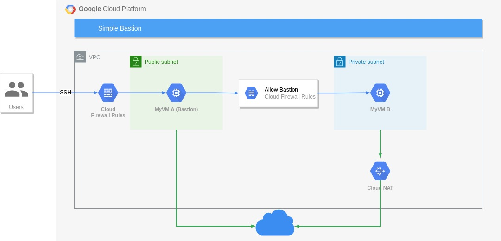

# Bastion

Creates two subnets:
- Subnet A: Public
- Subnet B: Private

Create two VMs, each one in a different subnet
- myvm-a: Subnet A with public address
- myvm-b: Subnet B without public address

Myvm-a is a bastion host, which access myvm-b. Firewall rules allow access from bastion.

## Diagram
